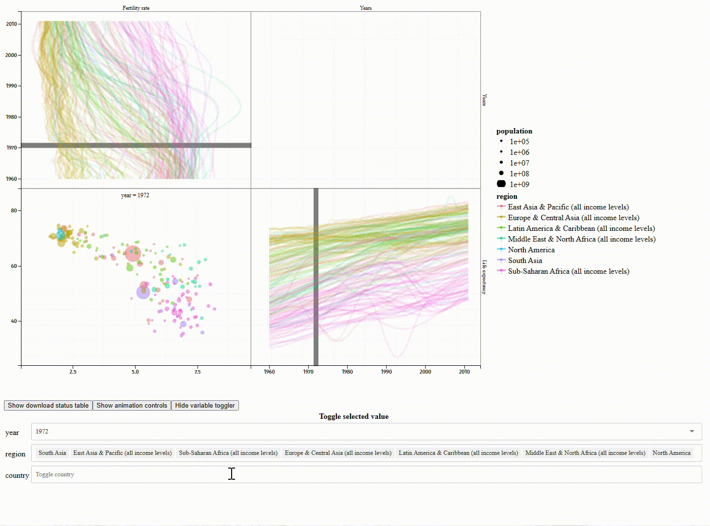

# Animint2

<a href="https://github.com/tdhock/animint2/actions/workflows/tests.yaml">
	
</a>
<!-- Feel free to change the HTML block above this comment into Markdown. It's just in HTML cuz I couldn't be arsed to figure out how to correctly combine an image and a link in Github-flavored Markdown. -->

Slides in [English](https://docs.google.com/presentation/d/1QDwo9x4OM7UKAXffJrny6nSfeytFR0kO5NB-NQEspcE/edit?usp=sharing) and [French](https://docs.google.com/presentation/d/1WpRZs9qz9wm1yik_MLj8tIJyWuL5-IBPYKLhOHZ9X4Y/edit?usp=sharing) for a 30-60 minute presentation about animint2!
[Abstract](https://github.com/animint/animint2/wiki/Presentations#30-60-minute-talk),
[Video of presentation in French at Toulouse-Dataviz](https://www.youtube.com/watch?v=Em6AVJi37zo).

## About

Animint2 is an R package for generating and sharing animated interactive data visualizations, sometimes referred to as animints. It is a fork of, and uses similar syntax to, [ggplot2](https://ggplot2.tidyverse.org/). Animint2 is especially useful for large datasets, but smaller datasets can be made interactive, too. It is also capable of generating static data visualizations.

<a href="https://rcdata.nau.edu/genomic-ml/WorldBank-facets/"></a> <!-- If you're familiar with Markdown, you may be wondering why I've elected to use HTML here instead of using the conventional . It's cuz R's pkgdown package renders the alt text as both alt text and a fig caption. That's redundant. Using  ensures that it comes out the way we want. -->

Play around with [this interactive data visualization of data from the World Bank](https://rcdata.nau.edu/genomic-ml/WorldBank-facets/), or [a more recent version which also includes a world map](https://tdhock.github.io/2025-01-WorldBank-facets-map/). For more examples, see these galleries, which have screenshots along with links to the interactive data viz, and source code:
* [NAU rcdata animint gallery](https://rcdata.nau.edu/genomic-ml/animint-gallery/) has 50+ big data viz examples dating back to animint's inception in 2014.
* [GitHub Pages animint gallery](https://animint.github.io/gallery) is a newer collection of animints that have been published using the `animint2pages` function.

To learn how to generate your own interactive data visualizations, go to the official [Animint2 Manual](https://rcdata.nau.edu/genomic-ml/animint2-manual/Ch00-preface.html). If you encounter problems, please see the [animint2 wiki](https://github.com/animint/animint2/wiki) or [report them](https://github.com/animint/animint2/issues).

[](https://codecov.io/gh/animint/animint2)

## Installation

``` r
# Install the official package from CRAN.
# This is the option most people should choose:
install.packages("animint2")

# If you want to install the development version:
devtools::install_github("animint/animint2")
```


## Use

Animint2 uses the same implementation of `ggplot2`’s grammar of graphics—with a few additions. If you’re familiar with `ggplot2`, using `animint2` will be easy. If you’re not, no worries. To get started, see the brief [Animint2 Quick Start Guide](https://animint.github.io/animint2/articles/animint2.html) or read the first few chapters of the [Animint2 Manual](https://rcdata.nau.edu/genomic-ml/animint2-manual/Ch00-preface.html).

`animint2` renders and animates data visualizations. It can neither manipulate the datasets you give it nor generate its own data.


## Similar Packages

`animint2` isn’t the only R package that can create animated or interactive data visualizations.

[animation](https://cran.r-project.org/package=animation) and [gganimate](https://cloud.r-project.org/web/packages/gganimate/index.html) can animate changes between variables over time. The [loon](https://cran.r-project.org/package=loon) package specializes in exploratory data analysis. [plotly](https://cran.r-project.org/package=plotly) is probably most similar to animint2 in terms of functionality.

For comparisons between the aforementioned packages and `animint2`, see [the differences wiki page](https://github.com/animint/animint2/wiki/Differences-with-other-packages).


## Problems?

The `animint2` package is a work in progress. If you spot any bugs or unexpected behaviors, please let us know by [reporting it as an issue on GitHub](https://github.com/animint/animint2/issues). Thanks! Have a great day.

## Other galleries

[Vatsal-Rajput](https://github.com/Vatsal-Rajput/Vatsal-Animint-Gallery/tree/gh-pages) created a small gallery with a different index.Rmd file.

[nhintruong](https://nhintruong.github.io/gallery_repo/) created a gallery with several example adapted from the animation package, like [the wiki page](https://github.com/tdhock/animint/wiki/Ports-of-animation-examples).
