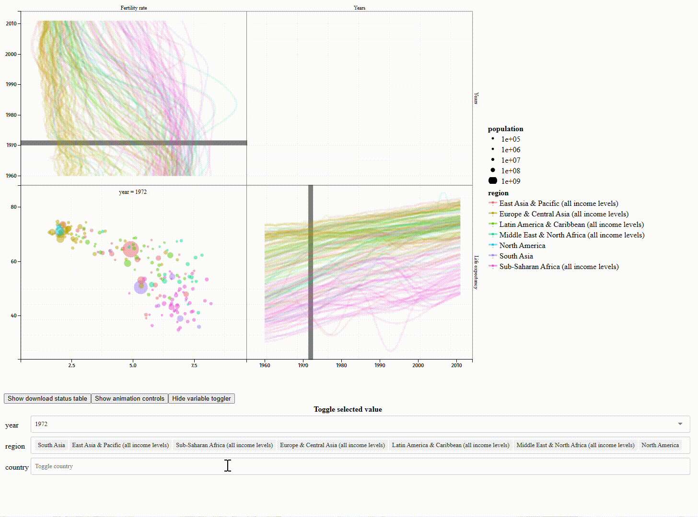

`animint2` is a fork of `ggplot2` with 

* web-based output, 
* and interactivity specified in R code, 
* using common column names across data sets.

It supports 

* multiple selection variables across multiple linked plots, 
* each with multiple layers/geoms (each with its own data set), 
* multiple interactive legends per plot, 
* multiple panels/facets per plot, 
* tooltips, animation, a guided tour, large data sets, and
* rendering from R code chunks in Rmd files, on GitHub Pages, or on any other web server (no special web server required)

Examples can be seen in…

|lang|gallery|manual|slides|paper|
|:--|:--|:--|:--|:--|
|en| [Gallery](https://animint.github.io/gallery/) | [Animated interactive data visualization using animint2 in R](https://animint-manual-en.netlify.app/) | [Animated, interactive figures with animint2 in R](https://docs.google.com/presentation/d/1QDwo9x4OM7UKAXffJrny6nSfeytFR0kO5NB-NQEspcE/edit?usp=sharing) | [Extending ggplot2 for Linked and Animated Web Graphics](https://amstat.tandfonline.com/doi/full/10.1080/10618600.2018.1513367) |
|fr| [La galerie](https://animint.github.io/gallery-fr/) | [Visualisation interactive de données dans R avec animint2](https://animint-manual-en.netlify.app/) | [Rajouter l'interactivité à vos ggplots avec animint2](https://docs.google.com/presentation/d/1WpRZs9qz9wm1yik_MLj8tIJyWuL5-IBPYKLhOHZ9X4Y/edit?usp=sharing) [Video](https://www.youtube.com/watch?v=Em6AVJi37zo) | [Abstract](https://github.com/animint/animint2/wiki/Presentations#30-60-minute-talk) |

[](https://codecov.io/gh/animint/animint2)

<a href="https://github.com/tdhock/animint2/actions/workflows/tests.yaml">
	
</a>
<!-- Feel free to change the HTML block above this comment into Markdown. It's just in HTML cuz I couldn't be arsed to figure out how to correctly combine an image and a link in Github-flavored Markdown. -->

## About

Animint2 is an R package for generating and sharing animated interactive data visualizations, sometimes referred to as animints. It is a fork of, and uses similar syntax to, [ggplot2](https://ggplot2.tidyverse.org/). Animint2 is especially useful for large datasets, but smaller datasets can be made interactive, too. It is also capable of generating static data visualizations.

<a href="https://rcdata.nau.edu/genomic-ml/WorldBank-facets/"></a> <!-- If you're familiar with Markdown, you may be wondering why I've elected to use HTML here instead of using the conventional . It's cuz R's pkgdown package renders the alt text as both alt text and a fig caption. That's redundant. Using  ensures that it comes out the way we want. -->

Try interacting with

* [this interactive data visualization of data from the World Bank](https://rcdata.nau.edu/genomic-ml/WorldBank-facets/), or
* [a more recent version which also includes a world map](https://tdhock.github.io/2025-01-WorldBank-facets-map/), or
* [its French translation](https://tdhock.github.io/2025-08-BanqueMondiale-facets-map/)!

If you encounter problems, please see the [animint2 wiki FAQ](https://github.com/animint/animint2/wiki/FAQ) or [write us an issue](https://github.com/animint/animint2/issues).

## Installation

```r
# Install the official package from CRAN.
# This is the option most people should choose:
install.packages("animint2")

# If you want to install the development version:
devtools::install_github("animint/animint2")
```


## Use

`animint2` is a fork of `ggplot2`, with a few additions for interactivity.
If you’re already familiar with `ggplot2`, then using `animint2` will be easy.
If you’re not, no worries.
To get started, see the brief [Animint2 Quick Start Guide](https://animint.github.io/animint2/articles/animint2.html) or read the first few chapters of the [Animint2 Manual](https://animint-manual-en.netlify.app).

## Similar Packages

`animint2` isn’t the only R package that can create animated or interactive data visualizations.
[animation](https://cran.r-project.org/package=animation) and [gganimate](https://cloud.r-project.org/web/packages/gganimate/index.html) can animate changes between variables over time.
The [loon](https://cran.r-project.org/package=loon) package specializes in exploratory data analysis.
[plotly](https://cran.r-project.org/package=plotly) can also create interactive graphics (but without the clickSelects and showSelected keywords).
For more comparisons, see [the differences wiki page](https://github.com/animint/animint2/wiki/Differences-with-other-packages).

## Problems?

The `animint2` package is a work in progress.
If you spot any bugs or unexpected behaviors, please let us know by [reporting it as an issue on GitHub](https://github.com/animint/animint2/issues).
Thanks! Have a great day.

## Other galleries

Toby Hocking maintains repositories on specific subjects:

* [gallery-ml](https://tdhock.github.io/gallery-ml) contains data visualizations related to machine learning algorithms.
* [gallery-change-point](https://tdhock.github.io/gallery-change-point) contains data visualizations related to change-point detection algorithms.
* [gallery-hic](https://tdhock.github.io/gallery-hic) contains data visualizations related to Hi-C data analysis.

Several GSOC contributors have created galleries:

* [Vatsal-Rajput](https://github.com/Vatsal-Rajput/Vatsal-Animint-Gallery/tree/gh-pages) created a small gallery with a different index.Rmd file.
* [nhintruong](https://nhintruong.github.io/gallery_repo/) created a gallery with several examples adapted from the animation package, like [the wiki page](https://github.com/tdhock/animint/wiki/Ports-of-animation-examples).
* [Nishita’s animint gallery](https://nishita-shah1.github.io/nishita-animint-gallery/)
* [Ashish Tiwari](https://ashishtiwari03.github.io/animint-gallery/)
